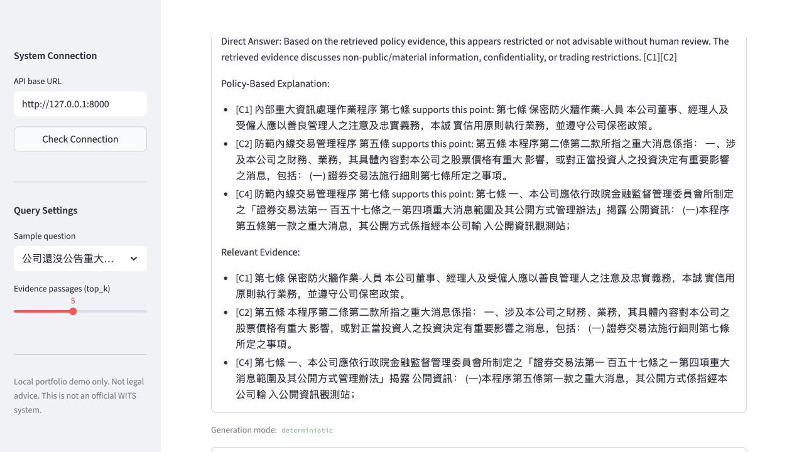
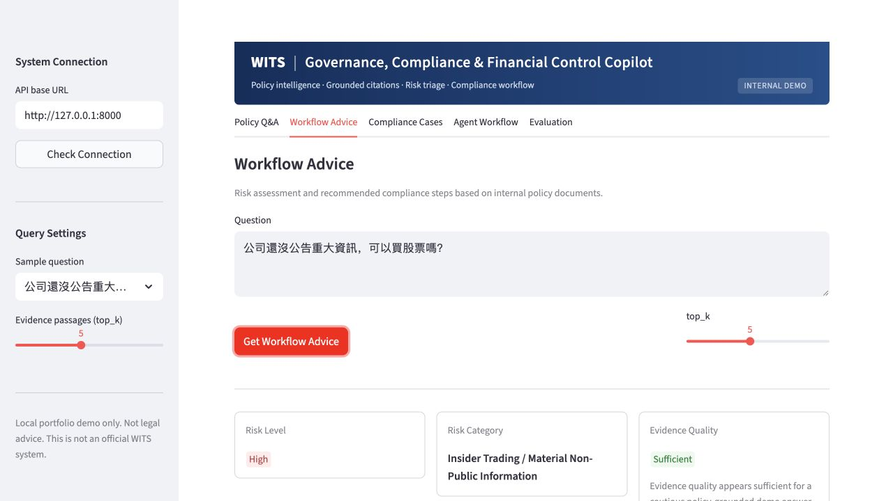
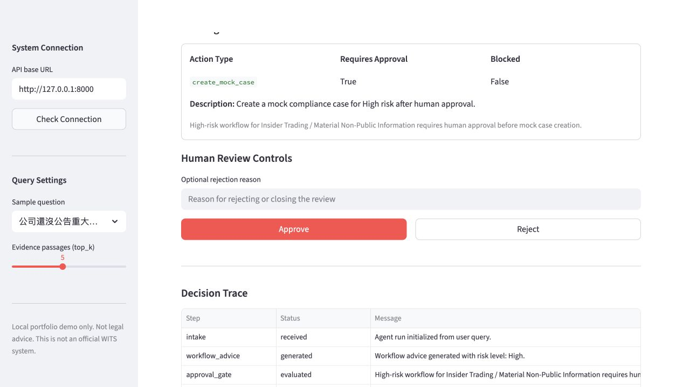
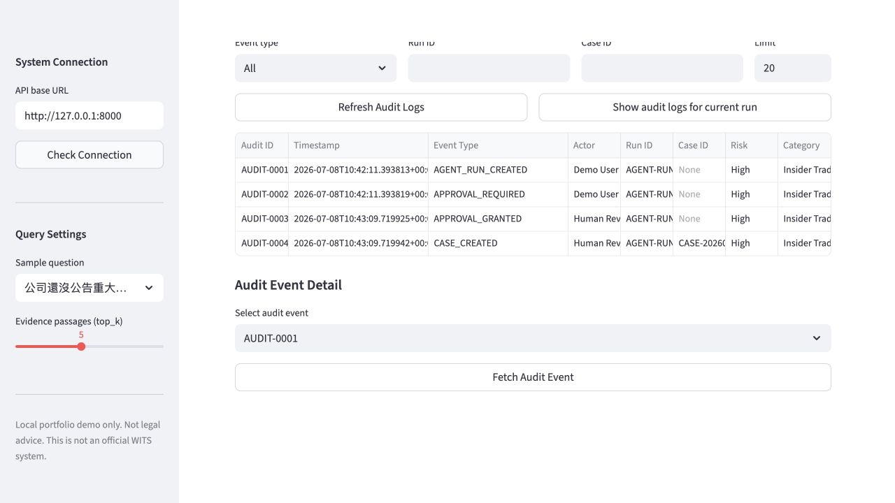

# WITS Governance, Compliance & Financial Control Copilot

A local-first enterprise AI copilot prototype for policy-grounded governance, compliance, and financial-control workflows. It combines PDF policy ingestion, article-aware chunking, hybrid retrieval, citation guardrails, deterministic fallback answers, optional DeepSeek-powered grounded Q&A, formal evaluation, human-in-the-loop approval, FastAPI agent endpoints, a Streamlit demo UI, a LangGraph conditional human-review branch, runtime audit logging, timing metadata, and an experimental query router/reranker that remains default off.

This is a portfolio prototype for project demonstration. It is not an official WITS system, not legal advice, and not production-ready compliance software.

## Business Problem

Enterprise users often need to check internal policy requirements across many governance documents. A useful compliance copilot must do more than produce fluent text: it must show traceable evidence, preserve citations, surface evidence quality, route high-risk matters to human approval, and keep auditable operational records. The system should not autonomously create cases or trigger real enterprise actions without review, and LLM answers must remain grounded in retrieved evidence rather than unsupported generation.

## Core Features

- PDF policy ingestion and article/section-aware chunking.
- Chroma vector retrieval plus BM25 hybrid search.
- Grounded policy Q&A with citation labels and evidence quality.
- Optional DeepSeek-powered grounded answer generation for Q&A.
- LLM fallback when evidence is insufficient, the API is unavailable, or citation guardrails fail.
- Workflow advice with deterministic risk triage and policy-supported checklist generation.
- Human-in-the-loop agent approval gate.
- FastAPI `/agent-runs` endpoints for start, inspect, approve, and reject.
- Streamlit Agent Workflow tab for controlled mock case workflows.
- LangGraph conditional human-review branch for graph-based orchestration demos.
- Runtime audit trail for governance-friendly event tracking.
- Timing metadata and performance visibility.
- Formal evaluation with a 30-case gold set.
- Experimental query router/reranker, feature-flagged and default off.

## Product Walkthrough

The following example shows how the copilot handles a high-risk policy question from evidence retrieval through controlled human action and audit logging.

### 1. Citation-Grounded Policy Q&A



The Policy Q&A interface retrieves relevant internal policy provisions and produces a grounded answer with inline citation labels. Users can inspect the supporting policy text, evidence quality, and generation mode instead of relying on an unsupported answer. The optional DeepSeek mode can improve answer wording, while the same retrieval evidence and citation guardrails remain in control.

### 2. Risk Triage and Workflow Advice



The workflow advisor converts retrieved policy evidence into a structured compliance assessment. It identifies the risk level and category, checks whether the evidence is sufficient, and generates a policy-supported workflow checklist. In this example, material non-public information is classified as a high-risk matter.

### 3. Human-in-the-Loop Approval Gate



High-risk actions stop at a human approval gate. The agent prepares a pending mock-case action and a visible operational decision trace, but it cannot create the case until a reviewer explicitly approves it. A rejection records the decision without creating a case, while insufficient-evidence cases remain blocked for manual review.

### 4. Governance Audit Trail



Each agent workflow produces an in-memory audit trail covering run creation, approval requirements, the reviewer's decision, and mock case creation. Audit records contain operational facts for traceability without storing hidden reasoning, full answers, or full evidence text.

## Architecture Overview

Q&A path:

```text
Policy PDFs
-> Chunking / Indexing
-> Hybrid Retrieval
-> Evidence Selection
-> Deterministic Grounded Answer
-> Optional DeepSeek Grounded LLM Answer
-> Citations / Evidence Quality / Disclaimer
-> FastAPI
-> Streamlit UI
```

Workflow path:

```text
Policy Evidence
-> Workflow Advice
-> Risk Triage
-> Human-in-the-loop Agent
-> Approval / Rejection
-> Mock Case Store
-> Audit Logs
```

LangGraph branch:

```text
High risk / insufficient evidence
-> LangGraph conditional human-review branch
-> approval routing
-> no automatic case creation
```

See [docs/architecture.md](docs/architecture.md) for the detailed architecture.

## Safety Design

- Local-first core prototype.
- Optional external DeepSeek API is used only when the user enables LLM mode.
- API keys are supplied through environment variables only.
- No API key or `.env` file should be committed.
- No email, Slack, Teams, Jira, ServiceNow, or real system mutation.
- Mock case creation only.
- High-risk action requires human approval.
- Insufficient Evidence blocks case creation or falls back to deterministic answers.
- The LLM layer only changes Q&A answer wording; it does not change risk level, workflow advice, approval decisions, case creation, audit logs, or LangGraph routing.
- Audit logs store operational facts only and do not store hidden reasoning.

## Evaluation Summary

Current deterministic v1.1 formal evaluation baseline:

| Metric | Value |
| --- | ---: |
| Total examples | 30 |
| Failed examples | 2 |
| Failed IDs | EVAL-015, EVAL-027 |
| hit_at_1 | 1.0000 |
| hit_at_3 | 1.0000 |
| hit_at_5 | 1.0000 |
| precision_at_5 | 0.2593 |
| recall_at_5 | 0.7284 |
| mrr | 1.0000 |
| ndcg_at_5 | 0.7864 |
| risk_accuracy | 0.9333 |
| category_accuracy | 0.9333 |
| insufficient_evidence_accuracy | 0.9333 |
| citation_coverage | 1.0000 |
| checklist_presence_accuracy | 0.9000 |

The remaining failures are mixed-policy or cross-policy cases. The experimental reranker remains feature-flagged and default off: default-off results matched baseline, while larger candidate expansion retrieved more relevant documents in diagnostics but introduced an EVAL-026 risk regression. The optional DeepSeek LLM layer was manually verified for grounded Q&A, but formal evaluation remains deterministic by default.

See [docs/evaluation_summary.md](docs/evaluation_summary.md) for details.

## Local Setup

Install dependencies:

```bash
python3 -m pip install -r requirements.txt
```

Run ingestion and indexing if starting from PDFs:

```bash
python3 -m src.ingestion.parse_pdfs
python3 -m src.retrieval.chunker
python3 -m src.retrieval.vector_store --build
python3 -m src.retrieval.bm25_store --build
```

Run the FastAPI backend:

```bash
python3 -m uvicorn backend.main:app --reload --port 8000
```

Run the Streamlit frontend:

```bash
python3 -m streamlit run frontend/streamlit_app.py
```

Run tests:

```bash
python3 -m pytest
```

Run deterministic formal evaluation:

```bash
python3 -m evaluation.run_eval --top-k 5
```

Optional DeepSeek configuration for LLM-assisted Q&A:

```bash
export DEEPSEEK_API_KEY=your_key_here
export DEEPSEEK_BASE_URL=https://api.deepseek.com
export DEEPSEEK_MODEL=deepseek-chat
export DEEPSEEK_TIMEOUT_SECONDS=30
```

Do not commit `.env` or real API keys.

## API Quick Examples

Health check:

```bash
curl http://127.0.0.1:8000/health
```

Deterministic Q&A:

```bash
curl -X POST http://127.0.0.1:8000/qa \
  -H "Content-Type: application/json" \
  -d '{"query":"公司還沒公告重大資訊，可以買股票嗎？","top_k":5,"use_llm":false}'
```

Optional LLM-assisted grounded Q&A:

```bash
curl -X POST http://127.0.0.1:8000/qa \
  -H "Content-Type: application/json" \
  -d '{"query":"公司還沒公告重大資訊，可以買股票嗎？","top_k":5,"use_llm":true}'
```

Workflow advice:

```bash
curl -X POST http://127.0.0.1:8000/workflow-advice \
  -H "Content-Type: application/json" \
  -d '{"query":"公司還沒公告重大資訊，可以買股票嗎？","top_k":5}'
```

See [docs/api_examples.md](docs/api_examples.md) for more examples.

## Demo Scenarios

The screenshots above present the primary end-to-end scenario. Additional local demo paths include:

- Policy Q&A with citations.
- Policy Q&A with DeepSeek LLM-assisted grounded answer.
- LLM fallback when evidence is insufficient.
- Workflow advice with risk triage.
- High-risk agent run requiring approval.
- Rejected agent action.
- Insufficient-evidence blocked case.
- Audit trail review.
- Performance metadata display.
- LangGraph human-review branch explanation.
- Formal evaluation result explanation.

Useful queries:

- `公司還沒公告重大資訊，可以買股票嗎？`
- `我想檢舉內部舞弊，應該提供哪些資料？`
- `衍生性商品交易可以投機嗎？`
- `關係人交易需要董事會核准嗎？`
- `這份文件有沒有說員工旅遊補助？`

See [docs/demo_script.md](docs/demo_script.md) for the project walkthrough.

## Limitations

This is a local portfolio prototype. It does not include production authentication, RBAC, durable databases, cloud deployment, persistent audit logs, or real enterprise workflow integrations. See [docs/limitations_and_future_work.md](docs/limitations_and_future_work.md).
